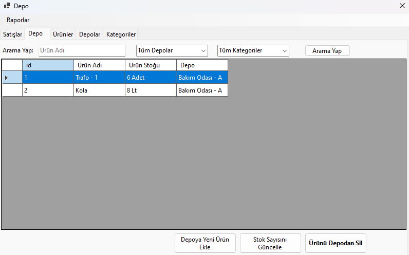

<br/>
<p align="center">
  <a href="https://github.com/PardusDev/DepoApp">
    
  </a>

  <h3 align="center">DepoApp</h3>

  <p align="center">
    A simple application to track your inventory.
    <br/>
    <br/>
    <a href="https://github.com/PardusDev/DepoApp"><strong>Explore the docs »</strong></a>
    <br/>
    <br/>
    <a href="https://github.com/PardusDev/DepoApp">View Demo</a>
    .
    <a href="https://github.com/PardusDev/DepoApp/issues">Report Bug</a>
    .
    <a href="https://github.com/PardusDev/DepoApp/issues">Request Feature</a>
  </p>
</p>


## About The Project

<p align="center">
  
</p>

This program was built to meet a need. It was developed for the purpose of inventory tracking in a factory.

Here are the desired features in the program:
* Product Categories
* Multiple Warehouses
* Adding Products
* Adding Products in Different Units of Measurement
* Sales and Revenue Generation
* Income-Expense Report
* Barcode Scanning
* Different User Logins (Not Completed)
* Output in PDF Format (Not Completed)

## Built With

This project was built with .NET 8.0. Entity Framework has been used. Additionally, it does local data storage. For this purpose, SQLite has been used.

## Getting Started

You can follow the steps below to download the project to your own device and continue developing it.

### Prerequisites

This is an example of how to list things you need to use the software.

* Visual Studio
* .NET 8.0

### Installation

1. Clone the repo


```sh
git clone https://github.com/PardusDev/DepoApp.git
```


2. Open .sln file.


## Usage

Download the built program and open it by double-clicking on the 'exe' file. There you go! Now you can use the application.
